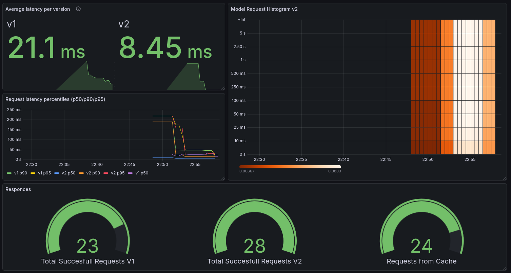

# Continuous Experimentation

This document contains our experiment and how it was impelemnted and its metrics.

## Experiment

For this experiment we implemented a ordered cache with configurable TTL.

| Name | Source | Description |
|------|--------|-------------|
| Stable | `main` branches of `app` and `model-service` repos | Has no caching implemented, each request gets evaluated |
| Canary | `canary-release` branches of `app` and `model-service` repos | Has a configurable cache implemented inside model-service and app can display when cache is used | 

## Changes to the code

There are changes to both `model-service` and `app` repositories. These changes are in the `canary-release` branch of both repos and are built using seperate Github Action workflows. These workflows build containers tagged with `canary` tag.

### Model service

Inside model service we implemented an ordered list class called cache that allows the requests that is not present inside the cache to be served as the result when requested. The reason we did the cache inside the `model-service` and not `app` is that with this design multiple `app` instances can connect to the `model-service` instance and request the same query without needing to recompute the request.

The cache is initilised inside `serve-model.py` and allows users to configure the TTL of the cache. When the TTL expires the item is not returned to the user and instead it gets recomputed.

### App

The app was modified to understand when a cached item is served to the user and display it to the user. We also implemented the nessesary metrics for the app.

## Hypothesis

> Enabling caching will reduce the latency at least 30% without affecting the acurracy negatively.

The hyptotheis is accepeted if:
- The latency of the canary version is at least 30% less than the stable version

Else reject the hypothesis

## Metrics

These are the metrics that will be used to test the hypothesis:

| Metric | Description | Location |
|--------|-------------|----------|
| `button_presses_counter` | Counter that gets incremented each time the submit button is pressed | Both |
| `http_request_duration_seconds` | Histogram distribution of total /sms prediction request handling time in seconds | Both |
| `model_call_duration_seconds` | Histogram distribution of model backend call duration in seconds | Both |
| `cached_guess_counter` | Total number of cached guesses served | `canary-release` |

## Traffic Routing

The stable and the canary versions of the app are given to the user using `istio` traffic touring with a 90/10 split. To ensure we always serve the new-new and the old-old versions we use istio sidecar injection and istio mesh services with cookies to validate whitch version to serve to the user.

## Desicion process

For this expermiment our hypothesis is clear and we have 2 conditions we need to achive for us to decide to promote the canary version. Those are:

- Have a latency reduction of at least 30% when requesting classification on the same text.
- Have at least 90% of the repeated request be responded from the cache.

## Experiment

The experiment was run on Firefox using 2 different containers. One of the browser containers had the canary flag set as true and the other one didn't. On each instance we made 30 requests split into 3 different queries. Each query was a paragrah of 5 sencences and they where ran back to back randomly swiching between `ham` and `spam` in each one.

After running the experiments, we observed the affects on the grafana dashboard.

## Results

We observed that the avarage latency between the `v1`(stable) and `v2`(canary) where more than 50% lower on the canary version. Also that more than 90% of the canary requests where responded from the cache. 

With this result we can confirm our hypotheses and make the desicion to promote the canary version.
