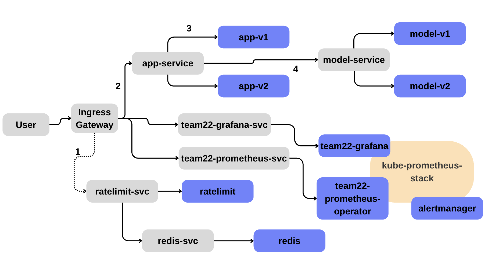

# Deployment Documentation

## Deployment Overview

This project is designed to fully create, provision and deploy a simple spam detection machine learning algorithm and its associated user interface onto a virtual machine cluster. As we are omitting the creation and provisioning of the virtual machines, this documentation will focus on the deployment, that runs on kubernetes for basic communication and uses an istio service mesh as an advanced form of traffic management and observation. We first discuss the general concepts used and then the request flow.

## Kubernetes Architecture

### Deployments

This project relies on Kubernetes to form its base cluster network. To this end it contains various deployments, names a separate deployment for each of the versions for the app's, and another for each of the model-service's. These deployments (can) create identical replicas of pods that allow the application to run. We create multiple replicas of the same version of each application, to ensure that in the case of a pod breaking, the other pods can take the requests, while kubernetes automatically recreates and reservices this pod, it allows allows for request distribution, minimising the strain on any individual component of the system. Each deployment also defines a specific port(s) that they listen on allowing them to receive the HTTP requests from the Service. In our application, the application frontend listen on the target port 8080, while the model-service backend listens to the target port 8081.

### Services

Kubernetes Services provide stable network identities for sets of pods. Services ensure pod-to-pod communication remains stable even as pods are recreated or rescheduled. In this deployment, services are used to expose both the application frontend and the model-service internally within the cluster. Services route requests to the appropriate pod replicas using label selectors, enabling transparent failover and load balancing.

### Ingress Gateways

To expose the application to external users, an ingress gateway is required. The ingress gateway creates an entry point to the cluster, which allows users to access the frontend application through an HTTP protocol. The ingress gateway receives and redirects all HTTP traffic from user requests to the requested/required service, which then handles the remaining logic, such as service to service communications to ensure that the frontend can make a request to the machine learning model. 

### Configuration Maps and Secrets

Configuration data is managed using Kubernetes ConfigMaps and Secrets. ConfigMaps store non-sensitive configuration values, while Secrets are used for sensitive data such as credentials or tokens. These resources are decoupled from application code and can be shared across deployments, improving maintainability and consistency.

### Namespaces and Access Control

To support logical separation and operational clarity, the cluster is organized using Kubernetes namespaces. Namespaces introduce logical boundaries within the cluster allowing resources to be grouped by purpose and enabling naming reuse across different parts of the system. Namespaces however do not enforce access restrictions by default. Access control is _implemented in Kubernetes Role-Based Access Control (RBAC) in combination with ServiceAccounts._ RBAC defines which actions are permitted within a namespace or across the cluster, while ServiceAccounts represent identities used by applications or operational tools when interacting with the Kubernetes API. This mechanism enables fine-grained permission management and limits access to sensitive cluster resources. Although not implemented in our deployment, aspects of this control are implemented during our provisioning.

### Monitoring and Observations

To observe the state and behavior of the deployment, multiple monitoring tools are used:

- The Kubernetes Dashboard provides a cluster-level overview, including pods, services, namespaces, and deployment status.
- Prometheus collects metrics related to application performance and traffic.
- Grafana visualizes these metrics through dashboards, enabling analysis of request rates, latency, error rates, and comparisons between different application versions

## Istio Service Mesh Architecture

Istio extends the Kubernetes deployment with a service mesh that provides fine-grained traffic control, observability and policy enforcement.

### Sidecars

Istio operates by injecting an Envoy sidecar into selected application pods, in our application this can be seen in the fields `sidecar.istio.io/inject: "true"`. These sidecars intercept inbound and outbound traffic, enabling traffic management and telemetry without requiring changes to the application code. Isto also allows the definition of a project wide sidecar which then automatically attaches a sidecar to each defined pod, however, this wasn't used as it is a less fine-grained approach.

### Istio Ingress Gateway

Instead of using a standard Kubernetes ingress controller, this deployment assumes the use of an Istio Ingress Gateway. This approach integrates with Istio's routing and policy mechanisms and serves as the new external entry point for all HTTP traffic.

### Traffic Routing and Canary Releases

Traffic management in Istio is defined using VirtualService and DestinationRule resources.

- Destination Rules define subsets corresponding to different application versions.
- VirtualServices define how traffic is routed to these subsets.
  Routing decisions are made at the ingress gateway and following a hierarchical logic, in our case:

1. If a request contains a specific cookie indicating a stable or canary version is desired, it is routed to the stable or canary resources accordingly.
2. If no matching cookie is present, traffic is split dynamically using a 90/10 canary release strategy, where 90% of all requests are routed to the stable version and 10% to the canary release.
   This routing logic enable controlled experimentation while allowing for controlled and benchmarked observations using the dashboards. This configuration can be changed under [the VirtualService configs for the app](../team22_chart/templates/app-ingress.yaml).

### Rate Limiting Extension

As an extension to the base project, global HTTP rate limiting is implemented at the Istio Ingress Gateway.
Rate limiting is enforced using Envoy's HTTP rate-limiting filter, configured via an EnvoyFilter resource. The filter intercepts incoming HTTP requests at the gateway and extracts request attributes, in our case the request path. These attributes are sent via gRPC to an external rate-limit service.
The rate-limit service evaluates the request against configured policies and stores request counters in a Redis backend to ensure consistency across multiple Ingress Gateway replicas. If a request exceeds the configured threshold, the gateway responds with an HTTP 429 error. As a failsafe, if the rate-limit service is unavailable, requests are immediately denied to prevent uncontrolled loads on the system. Please refer to the A4 review document for details on the implementation.

## Request Flow Through the System

The visualization below outlines the main components of our cluster and the data flow between them, with details like sidecars redacted for simplicity.

The main request flow is outlined below:
1. A request handled by the Ingress Gateway initially gets checked against the rate-limiting restrictions. Using a separate service with redis storage, the service evaluates if this request should be restricted or not based on its path. The flow continues if it is within restrictions.
2. Based on the correlating hosts, the request gets routed to the app-service where it is evaluated against traffic routing rules. 
3. Here, sticky sessions are implemented with cookies, whose details can be seen in the [Traffic Routing Section](#traffic-routing-and-canary-releases). 
4. Once a model response is requested, this gets routed based on its version as a label to always match a v1 app with a v1 model and vice versa. This can be seen in the [model-service VirtualService](../team22_chart/templates/app-ingress.yaml).

In the visualization we also outline how we expose the Grafana and Prometheus dashboards for further detail and convenience, but this is a separate workflow. 